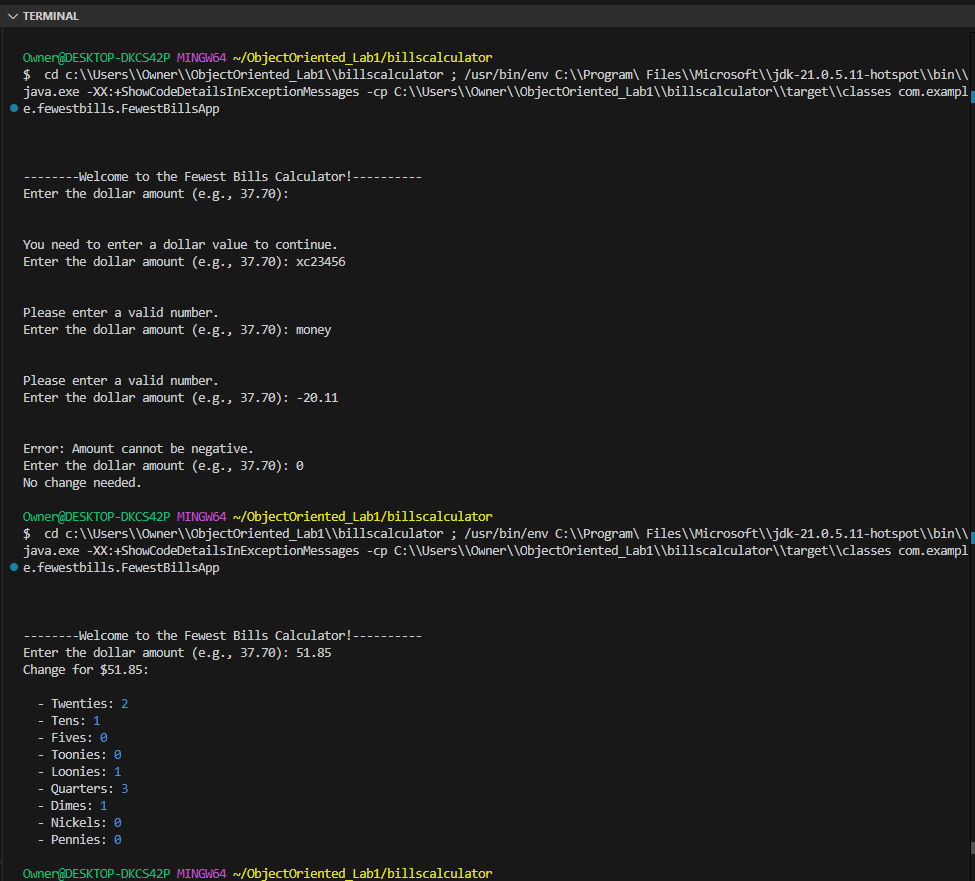

# Fewest Bills Calculator

## Synopsis
The Fewest Bills Calculator is a Java application that calculates the fewest number of bills and coins needed to make up a given dollar amount. The application consists of three main modules:1.[FewestBillsApp](src/main/java/com/example/fewestbills/FewestBillsApp.java)2. [BillsCalculatorClass](src/main/java/com/example/fewestbills/BillsCalculatorClass.java)3. [FewestbillsErrorhandlingClass](src/main/java/com/example/fewestbills/FewestbillsErrorhandlingClass.java)

## Modules

### FewestBillsApp
This is the main entry point of the application. It handles user input and output, and coordinates the calculation process.
- [FewestBillsApp.java](src/main/java/com/example/fewestbills/FewestBillsApp.java)

### BillsCalculatorClass
This class contains the logic for calculating the fewest number of bills and coins needed for a given dollar amount.
- [BillsCalculatorClass.java](src/main/java/com/example/fewestbills/BillsCalculatorClass.java)

### FewestbillsErrorhandlingClass
This class handles input validation and error handling for the application.
- [FewestbillsErrorhandlingClass.java](src/main/java/com/example/fewestbills/FewestbillsErrorhandlingClass.java)

## Usage
To use the Fewest Bills Calculator, follow these steps:

1. Clone the repository to your local machine.
2. Open the project in your preferred Java IDE.
3. Run the FewestBillsApp class.
4. Follow the prompts to enter the dollar amount for which you want to calculate the fewest bills and coins.
5. The application will display the fewest number of bills and coins needed to make up the given dollar amount.

Author : [Harry Joseph Github](https://github.com/hjoseph777/) 
- Date : January 18, 2025